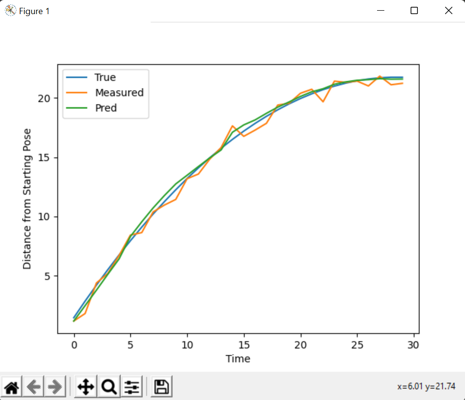

# Kalman Filter Exercise



## What are Kalman Filters?
A Kalman Filter is a algorithmic filter that is used to estimate the state of an unknown variable. It typically is more accurate than measuring the variable directly.

## How do they work?
Kalman Filters consist of two steps; the predict step and the update step. The Predict step estimates the state of the unknown variable using some other related measurement. Then the update step measures this variable directly and makes a similar estimate.
The resultant final estimate is a combination of these two steps, weighted according to the covariance of each measurement.

## Simulator
In this sim, we some object ( for example a car ) an initial velocity which is gradually reduced by some coefficient of friction, until it comes to rest.
We take measurements of the pose of the car, using a single lidar scan against an object 200 units directly in front of it. We also take a measurement of the velocity of the car at each timestep. Both of these measurements have noise added to them before being processed by the Kalman Filter.

## Requirements 
- [pygame](https://www.pygame.org/news)
- [numpy](https://numpy.org)

## How to Run the Simulator 
To run the simulator, just run the following command in your terminal  :
```
python kf-exercise.py
```
